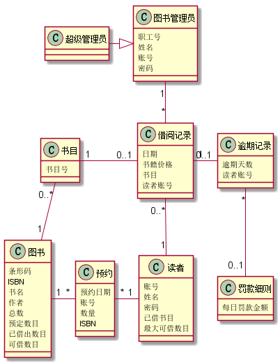
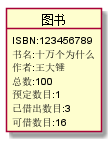
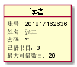
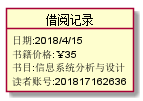

# 实验三：图书管理系统领域对象建模
<table>
<tr>
<td>学号</td>
<td>班级</td>
<td>姓名</td>
<td>照片</td>
</tr>
<tr>
<td>201510414328</td>
<td>2015级软件工程三班</td>
<td>钟志国</td>
</tr>
</table>

## 1 图书管理系统类图
### 1.1 类图PlantUML源代码:
    @startuml
    class 书目{
         书目号
    }
    class 图书{
        条形码
        ISBN
        书名
        作者
        总数
        预定数目
        已借出数目
        可借数目
    }
    class 预约{
        预约日期
        账号
        数量
        ISBN
    }
    class 读者{
        账号
        姓名
        密码
        已借书目
        最大可借数目
    }
    class 借阅记录{
        日期
        书籍价格
        书目
        读者账号
    }
    class 逾期记录{
        逾期天数
        读者账号
    }
    class 罚款细则{
       每日罚款金额
    }
    class 图书管理员{
        职工号
        姓名
        账号
        密码
    }
    class 超级管理员{
    }

    书目 "0..*" - "1" 图书
    图书 "1"--right--"*"预约
    预约 "*"-right-"1"读者
    读者 "1"-up-"0..*"借阅记录
    借阅记录 "0..1"-left-"1"书目
    借阅记录 "1"-"0..1"逾期记录
    借阅记录"*"-up-"1"图书管理员
    逾期记录"*"--"0..1"罚款细则
    图书管理员<|-left-超级管理员
    @enduml

### 1.2 类图如下：

### 1.3 类图说明：
该类图主要有图书类、预约类、读者类、书目类、借阅记录类、图书管理员类、逾期记录及罚款细则类，其中 书目类与图书类、预约类与图书类、读者类与预约类、借阅记录与读者类存在多对一的关系,书目类与借阅记录类、逾期记录和借阅 记录类存在一对一或者一对零的关系

## 2 图书管理系统的对象图
### 2.1 类图书类的对象：
#### 源码：
    @startuml

    object 图书{
         ISBN:123456789
         书名:十万个为什么
         作者:王大锤
         总数:100
         预定数目:1
         已借出数目:3
         可借数目:16
    }
    @enduml

#### 对象图：

### 2.2 读者类的对象:
#### 源码：
     @startuml

      object 读者{
           账号：201817162636
           姓名：张三
           密码：******
           已借书目：3
           最大可借数目：20
     }
     @enduml

#### 对象图：

### 2.3 借书记录类的对象:
#### 源码：
    @startuml

    object 借阅记录{
            日期:2018/4/15
            书籍价格:￥35
            书目:信息系统分析与设计
            读者账号:201817162636
    }
    @enduml

