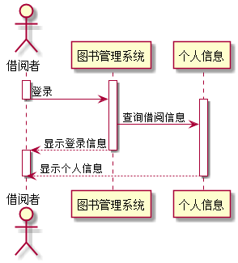
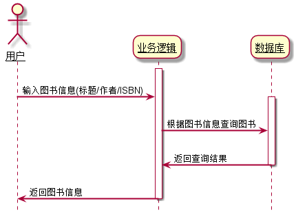
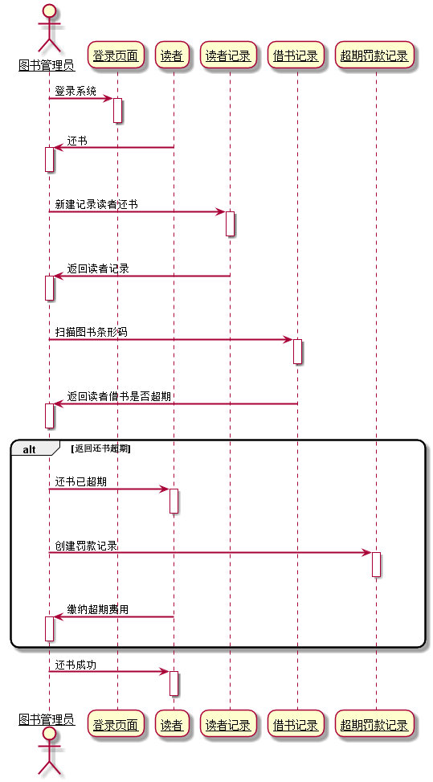
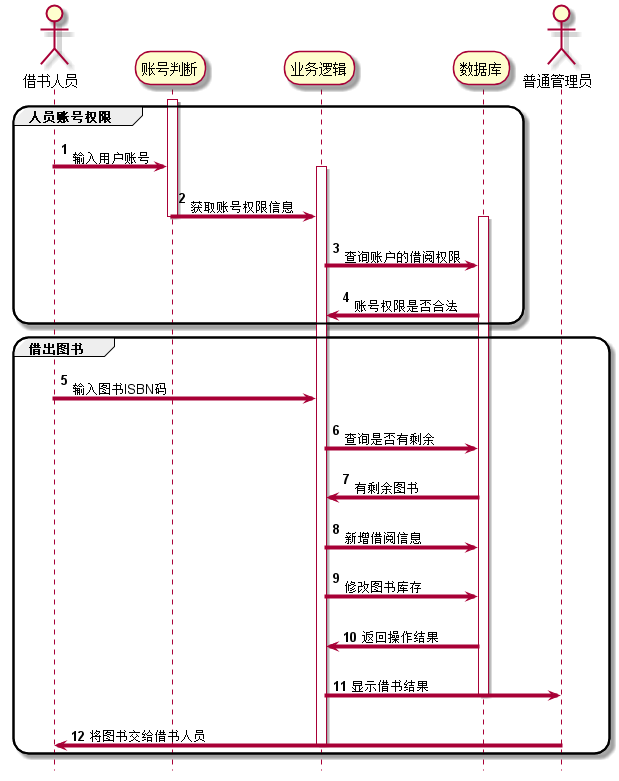
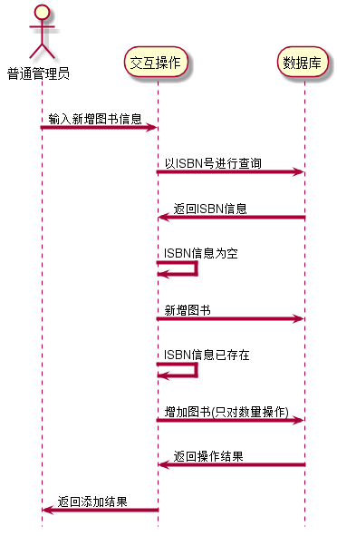

# 实验四：图书管理系统顺序图绘制
<table>
<tr>
<td>学号</td>
<td>班级</td>
<td>姓名</td>
</tr>
<tr>
<td>201510414328</td>
<td>2015级软件工程三班</td>
<td>钟志国</td>
</tr>
</table>

## 1.借阅者查询个人用例
### 1.1查询个人信息PlantUML源码如下：
    
    @startuml
    actor  借阅者 as reader
    activate reader
    activate 图书管理系统
    reader->图书管理系统:登录
    deactivate reader
    activate 个人信息
    图书管理系统->个人信息:查询借阅信息
    图书管理系统-->reader:显示登录信息
    deactivate 图书管理系统
    activate reader
    个人信息-->reader:显示个人信息
    deactivate 个人信息
    deactivate reader
    @enduml
### 1.2查询个人信息用例图如下：

## 2.查询图书用例顺序图
### 2.1 查询图书的PlantUML源码如下：
    @startuml
    skinparam sequenceArrowThickness 2
    skinparam roundcorner 20
    skinparam maxmessagesize 60
    skinparam sequenceParticipant underline
    hide footbox

    actor 用户

    activate 业务逻辑
	用户 -> 业务逻辑 :  输入图书信息(标题/作者/ISBN)
		activate 数据库
			业务逻辑 -> 数据库 : 根据图书信息查询图书
			数据库 -> 业务逻辑 : 返回查询结果
		deactivate 数据库
			业务逻辑 -> 用户 : 返回图书信息
deactivate 业务逻辑

    @enduml
### 2.2查询图书用例图如下：

##3.还书用例顺序图
### 3.1 还书的PlantUML源码如下：
@startuml
skinparam sequenceArrowThickness 2
skinparam roundcorner 20
skinparam maxmessagesize 60
skinparam sequenceParticipant underline

actor 图书管理员

图书管理员 -> 登录页面: 登录系统
activate 登录页面
deactivate 登录页面

读者 -> 图书管理员: 还书
activate 图书管理员
deactivate 图书管理员

图书管理员->读者记录:新建记录读者还书
activate 读者记录
deactivate 读者记录

读者记录->图书管理员:返回读者记录
activate 图书管理员
deactivate 图书管理员

图书管理员->借书记录:扫描图书条形码
activate 借书记录
deactivate 借书记录

借书记录->图书管理员:返回读者借书是否超期
activate 图书管理员
deactivate 图书管理员

alt 返回还书超期
图书管理员->读者:还书已超期
activate 读者
deactivate 读者

图书管理员->超期罚款记录:创建罚款记录
activate 超期罚款记录
deactivate 超期罚款记录

读者->图书管理员:缴纳超期费用
activate 图书管理员
deactivate 图书管理员
end

图书管理员->读者:还书成功
activate 读者
deactivate 读者
@enduml
### 3.2查询图书用例图如下：

##4.借出图书用例顺序图
### 4.1 借出图书的PlantUML源码如下
@startuml

skinparam sequenceArrowThickness 4
skinparam roundcorner 30
skinparam maxmessagesize 10
hide footbox

actor 借书人员

autonumber
group 人员账号权限
activate 账号判断
	借书人员 -> 账号判断 :  输入用户账号
	activate 业务逻辑
		账号判断 -> 业务逻辑 : 获取账号权限信息
deactivate 账号判断
		activate 数据库
			业务逻辑 -> 数据库 : 查询账户的借阅权限
			数据库 -> 业务逻辑 : 账号权限是否合法
end
group 借出图书
			借书人员 -> 业务逻辑 : 输入图书ISBN码
			业务逻辑 -> 数据库 : 查询是否有剩余
			数据库 -> 业务逻辑 : 有剩余图书
			业务逻辑 -> 数据库 : 新增借阅信息
			业务逻辑 -> 数据库 : 修改图书库存
			actor 普通管理员
			数据库 -> 业务逻辑 : 返回操作结果
			业务逻辑 -> 普通管理员: 显示借书结果
		deactivate 数据库
	    普通管理员 -> 借书人员 : 将图书交给借书人员
	deactivate 业务逻辑
end

@enduml
### 4.2借出图书用例图如下：

##5.添加图书用例顺序图
### 5.1 添加图书的PlantUML源码如下
@startuml
skinparam sequenceArrowThickness 4
skinparam roundcorner 30
skinparam maxmessagesize 10
hide footbox
actor 普通管理员 as admin
admin -> 交互操作 : 输入新增图书信息
			交互操作 -> 数据库 : 以ISBN号进行查询
			数据库 -> 交互操作 : 返回ISBN信息
			交互操作 -> 交互操作 : ISBN信息为空
			交互操作 -> 数据库 : 新增图书
			交互操作 -> 交互操作 : ISBN信息已存在
	        交互操作 -> 数据库 : 增加图书(只对数量操作)
			数据库 -> 交互操作 : 返回操作结果
		    deactivate 数据库
	        交互操作 -> admin : 返回添加结果
	deactivate 交互操作
@enduml
### 5.2借出图书用例图如下：

##6.总结
### 6.1在本次实验中，展示了总体的顺序图和三个重要操作的顺序图，对图书管理系统的操作流程有了最基础的展现，对于系统功能的实现有一定的帮助。