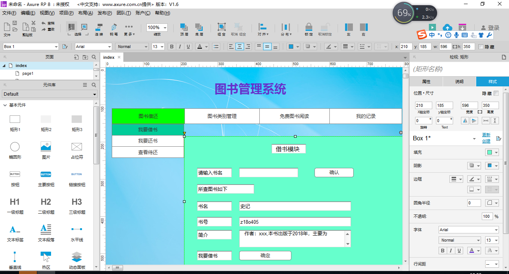

# 实验四：图书管理系统顺序图绘制
<table>
<tr>
<td>学号</td>
<td>班级</td>
<td>姓名</td>
</tr>
<tr>
<td>201510414328</td>
<td>2015级软件工程三班</td>
<td>钟志国</td>
</tr>
</table>

## 1.数据库表设计

## 1.1. 图书描述类表
|字段|类型|主键，外键|可以为空|默认值|约束|说明|
|:-------:|:-------------:|:------:|:----:|:---:|:----:|:-----|
|ISBN|varchar(50)|主键|否||||
|bookName|varchar(50)| |否||||
|bookType|varchar(50)| |否||||
|describe|varchar(200)| |否||||
|price|double| |否||||
|author|varchar(50)| |否||||
|bookVersion|varchar(50)| |否||||

###1.2 读者表

|字段|类型|主键，外键|可以为空|约束|说明|
|:-------:|:-------------:|:------:|:----:|:---:|:-----|    
|readerId|varchar(10)|主键|否|||
|name|varchar(50)| |否|||  
|password|varchar(10)| |否|||
|sex|bit(1)| |否|||  
|born|datetime(100)| |否|||
|spec|varchar(100)| |否|||  
|num|int(100)| |否|||
|photo|varbinary(3000)| |否|||  

 ###1.3 图书管理员表
 
 |字段|类型|主键  ，外键|可以为空|约束|说明|
 |:-------:|:-------------:|:------:|:----:|:---:|:-----|    
 |bookAdminId|varchar(100)|主键|否|||
 |name|varchar(100)| |否|||  
 |password|varchar(100)| |否|||
 
 ## 1.4. 图书记录表
 |字段|类型|主键，外键|可以为空|默认值|约束|说明|
 |:-------:|:-------------:|:------:|:----:|:---:|:----:|:-----|
 |recordId|int|主键|否||||
 |ISBN|varchar(50)| |否||||
 |bookName|varchar(50)| |否||||
 |bookNum|varchar(50)| |否||||
 |readerId|int| |否||||


## 2. 界面设计
## 2.1. 借书界面设计

- 用例图参见：借书用例
- 类图参见：借书类，读者类
- 顺序图参见：借书顺序图
- API接口如下：

1. 借阅者API

- 功能：获取用户基本信息
- 请求地址： http://localhost:8080/BManager/api/List
- 请求方法：GET
- 请求参数：

|参数名称|必填|说明|
|:-------:|:-------------: | :----------:|
|readerId|是|读者的id|
|access_tip|是|用于验证请求合法性的认证信息。 |
|method|是|固定为 “GET”。|

- 返回示例：
```
{
  "data": [
        {
            "id": "1001",
            "name": "zzg"
        }
    ],
    "code": 200
}
```
- 返回参数说明：
    
|参数名称|说明|
|:-------:|:-------------: |
|data|用户的信息|
|code|返回码|

###2.2 查询读者
- 功能：用于获取全部分类
- 请求地址： http://localhost:8080/BManager/api/checkList
- 请求方法：POST
- 请求参数：

|参数名称|必填|说明|
|:-------:|:-------------: | :----------:|
|readerid|是|用于查询读者信息|

- 返回实例：
```
{
    "reader": {
        "readercat": "好",
        "name": "ccm",
     },
    "code": 200
}
```
- 返回参数说明：
    
|参数名称|说明|
|:-------:|:-------------: |
|reader|读者信息|
|code|返回码|
