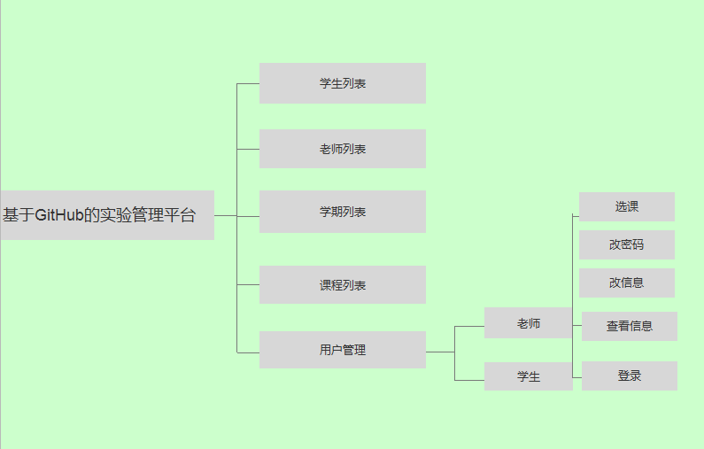
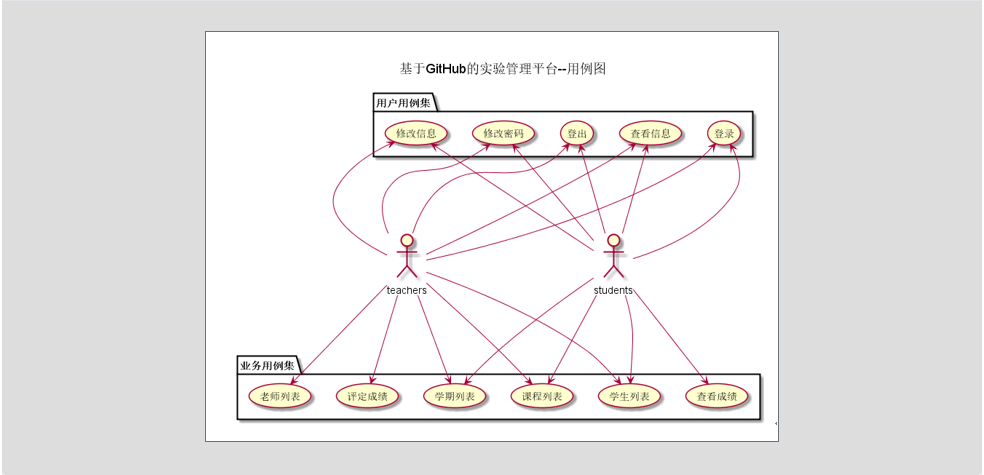
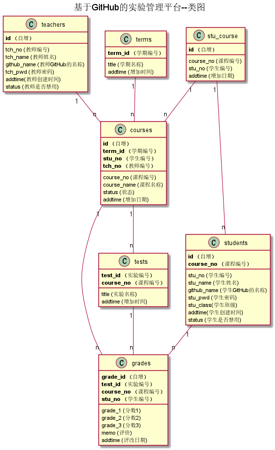

 # 实验6：基于GitHub的实验管理平台的分析与设计
 <table>
<tr>
<td>学号</td>
<td>班级</td>
<td>姓名</td>
</tr>
<tr>
<td>201510414328</td>
<td>2015级软件工程三班</td>
<td>钟志国</td>
</tr>
</table>

## 1.系统总体结构

 
## 2.用例图设计 [源码](src/usercase.puml)

## 3.类图设计 [源码](src/class.puml)

## 4.数据库设计
- ### [参见数据库设计](数据库设计/DateBaseDesigin.md)

## 5.用例及界面详细设计
- ### [“登录”用例](用户/login.md),[界面](https:///ccm1314.github.io/is_analysis/test6/界面/index.html)
- ### [“登出”用例](用户/logOut.md),[界面](https://ccm1314.github.io/is_analysis/test6/界面/logout.html)
- ### [“学生列表”用例](用户/studentList.md),[界面](https://ccm1314.github.io/is_analysis/test6/界面/studentlist.html)
- ### [“老师列表”用例](用户/teacherList.md),[界面](https://ccm1314.github.io/is_analysis/test6/界面/teacherList.html)
- ### [“学期列表”用例](用户/termList.md),[界面](https://ccm1314.github.io/is_analysis/test6/界面/termList.html)
- ### [“查看成绩”用例](用户/grade.md),[界面](https://ccm1314.github.io/is_analysis/test6/界面/Grade.html)
- ### [“修改学生信息”用例](用户/changeUserMessage.md),[界面](https://ccm1314.github.io/is_analysis/test6/界面/updateStudentInfo.html)
- ### [“修改密码”用例](用户/changePassword.md),[界面](https://ccm1314.github.io/is_analysis/界面/updatePassword.html)
 
 
